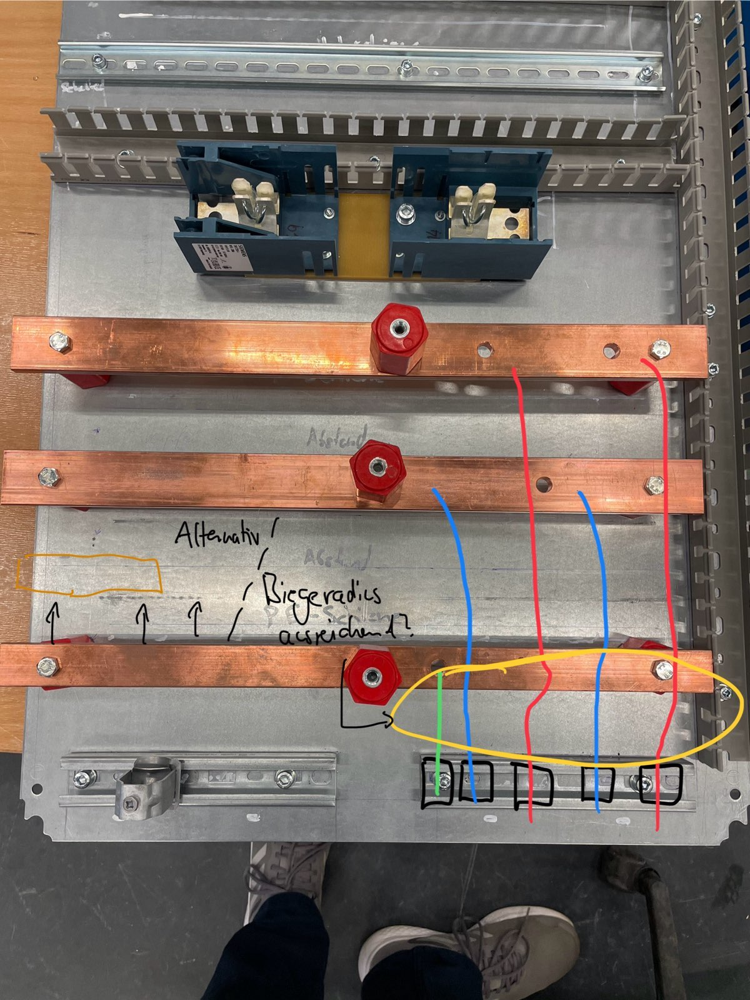
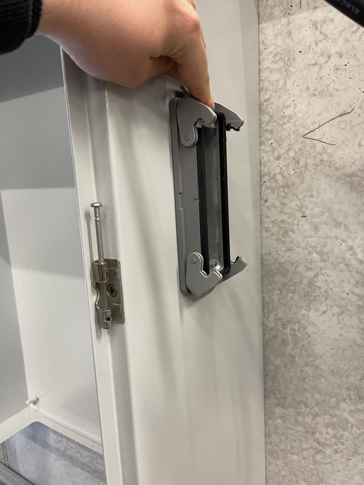
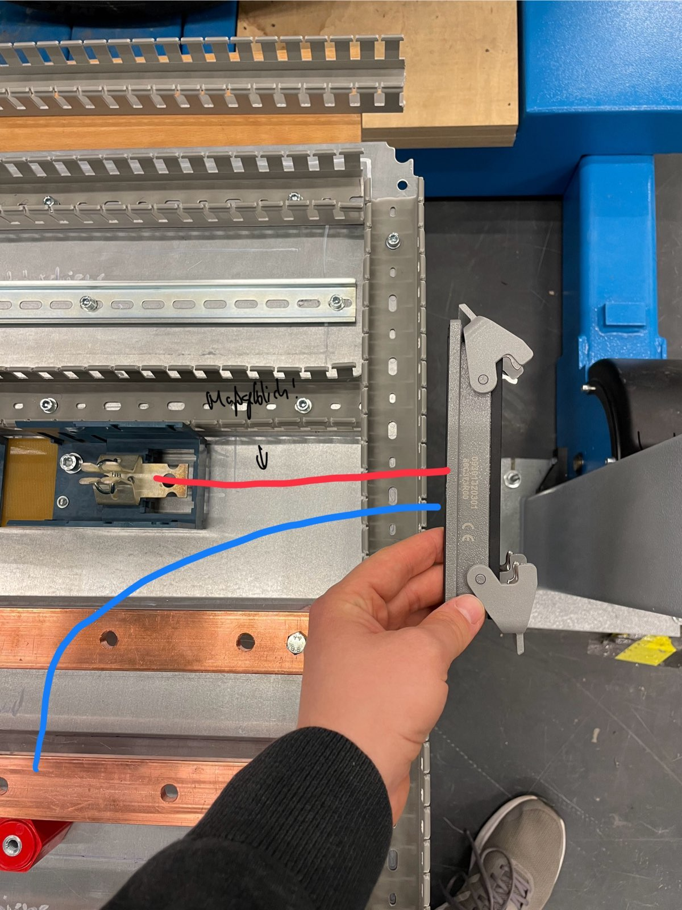
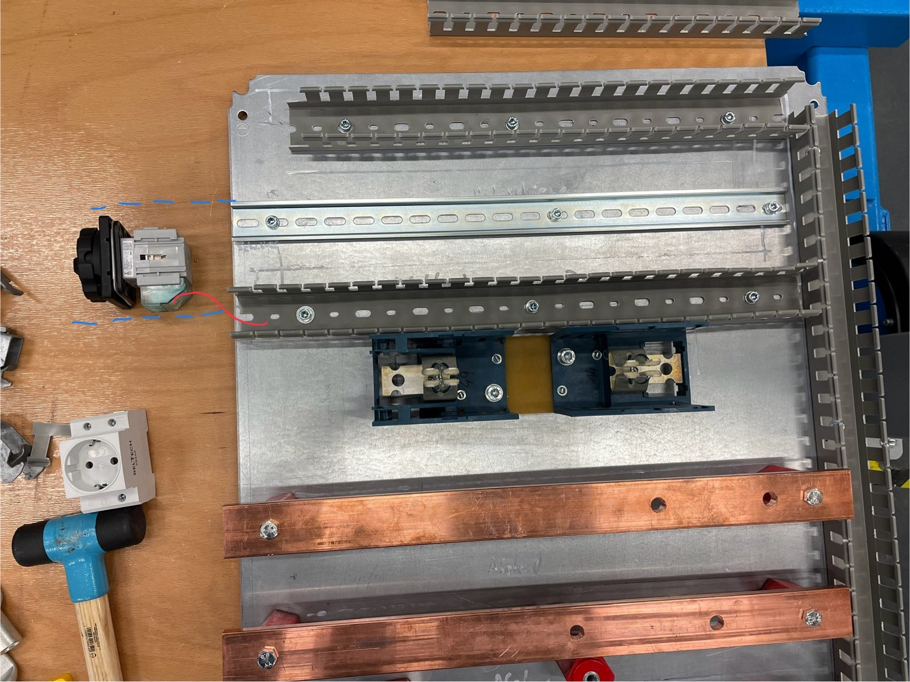

# ToDos an der Ladesäule (mechanischer Aufbau)
Stand: 23.05.2024
Autor: Marco

Vor den meisten Arbeiten ist es erst einmal notwendig, die Rückplatte in den Schaltschrank zu setzen, damit die Positionen für Löcher / Bohrungen bestimmt werden können. Dafür muss sie natürlich nicht fertig eingebaut, aber eingehängt und mit 2 Schrauben gesichert werden. Nach dem Anzeichnen der notwendigen Löcher, muss sie wieder entnommen werden (dann sind die Komponenten auch vor Spänen geschützt).

## Rückplatte

### Kupferschienen
Bei den Kupferschienen muss noch überprüft werden, ob der Biegeradius von der Kabelentlastung (ganz unten) über die Erdungsschiene ausreicht. Alternativ müsste die Erdungsschiene noch etwas nach oben versetzt werden, sodass sich in etwa derselbe Abstand wie zwischen den beiden oberern Schienen ergibt.

- [ ] Unter Umständen Erdungsschiene versetzen (s.o.)
- [ ] Kupferschienen mit richtigen Isolatoren befestigen (3 Isolatoren je Schiene, 3 verschiedene Längen)

### Kabeleinführung

An der Bodenplatte müssen Löcher für die Kabeleinführung gebohrt werden. Die größeren Durchführungen haben etwa 40mm, die kleineren etwa 20mm Durchmesser. Von beiden werden 4 Stück montiert. Die 4 kleinen werden an der rechten Seite montiert, sodass die Leitungen (2x Ethernet, 1x Interlock, 1x Sense) am rechten Kabelkanal verlegt werden können. Die großen werden so montiert, dass die Leitungen gut auf die Zugentlastung geführt werden können (Testen und Anzeichnen, wenn Platte montiert ist).

Für die Erdungsleitung muss noch eine passende (18mm) Durchführung gekauft werden, diese wird später montiert. Für die kleinen fehlen aktuell noch Muttern zum Befestigen.

### Schaltschranktür

In der Türe muss (ziemlich mittig) ein Loch für den Not-Aus Schalter (22mm) angefertigt werden.
Darüber muss das Spannungsmessgerät (Weigel) eingebaut werden, wofür ein rechteckiger Ausschnitt anzufertigen ist (mit dem Gerät anzeichnen).

### Schaltschrank

An der rechten Seite des Schaltschranks muss die Buchse für den Ladestecker montiert werden (Position in etwa):

Die Position soll so bestimmt werden, dass die Leitung von der Sicherung aus relativ gerade in den Ausschnitt führt:

An der linken Seite wird der Hauptschalter (Siemens) so montiert, dass die Leitungen gut in den Kabelkanal geführt werden können:

Für den Hauptschalter sind 5 Bohrungen notwendig, evtl. kann die Dichtung des Schalters als Vorlage verwendet werden.