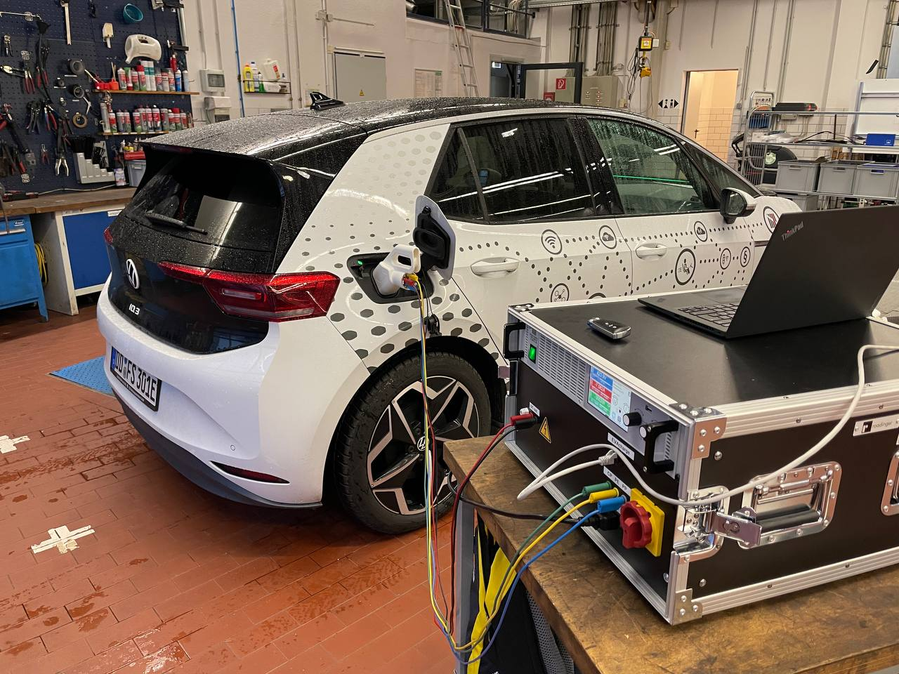

# dc-charging-station



This repository contains glue code in order to create a fully working DC charging station.

In our case we use ~~[open-plc-utils](https://github.com/qca/open-plc-utils)~~ [EcoG-io/pyslac](https://github.com/EcoG-io/pyslac) for SLAC, [EcoG-io/iso15118](https://github.com/EcoG-io/iso15118) for the ISO15118 stack, an [EVAcharge SE](https://chargebyte.com/controllers-and-modules/evse-controllers/evacharge-se) for powerline communication and a ~~[Kratzer Automation battery tester](https://www.ni.com/de/shop/power-electronics-test-systems.html)~~ [EA-PSB 11000-10](https://elektroautomatik.com/shop/en/products/programmable-dc-laboratory-power-supplies/bidirectional-dc-laboratory-power-supplies/series-psb-10000-2u-1-5-3kw/1147/bi-directional-power-supply) as a bidirectional HV power supply.

## Components

The idea of this repository is to have hardware abstraction interfaces which can be implemented for different hardware.
All of these interfaces (python abstract base classes) are defined in the `base_classes.py` file.

For implementing a charging station you need to implement the `ChargingStation` class as well as the `HighVoltageSource` class.
You can then give them as parameters to the ISO15118 EVSE controller based on [EcoG-io/iso15118](https://github.com/EcoG-io/iso15118).
This controller will handle vehicle detection, iso15118 communication and high voltage source parameter setting.

## Running

First connect your PC via ethernet to both the EVAcharge and the EA-PSB.
In our setup both have static IP addresses configured in a /24 network.
`192.168.188.100` for the EA-PSB and `192.168.188.250` for the evacharge.

Connect to the evacharge via ssh, flash the modem and run socat for forwarding the low level controls.

```bash
# ./flash-qca-temporarily.sh
# socat tcp-l:2020,reuseaddr,fork,crlf file:/dev/ttyAPP2,echo=0,b57600,raw
```

In a second terminal start the actual charging station code:
```bash
$ python -m venv venv
$ . venv/bin/activate
$ pip install -r requirements.txt
$ NETWORK_INTERFACE=enx7cc2c61f051e FREE_CHARGING_SERVICE=True LOG_LEVEL=INFO python3 secc-main.py
```

After plugging in the vehicle the charging process should start automatically.

## Environment Variables

### **dc-charging-station**

These variables control the main application logic and the selection of hardware interface implementations.

| ENV | Default Value | Description |
|---|---|---|
| `LOG_LEVEL` | `INFO` | The logging level for the Python log service. Applies to the entire application. |
| `NETWORK_INTERFACE` | `eth0` | The network interface name (e.g., `enx7cc2c61f051e`) used for the communication. |
| `HIGH_VOLTAGE_CONTROLLER_IMPL` | `mock` | Specifies which implementation of the `HighVoltageSource` abstract base class to use. |
| `DIN_61851_IMPL` | `mock` | Specifies which implementation to use for the basic PWM signaling according to IEC 61851-1. |
| `FREE_CHARGING_SERVICE` | `False` | If set to `True`, the charging service is provided without requiring authorization. |

### **pyslac (SLAC Protocol)**

These variables are used to configure the SLAC (Signal Level Attenuation Characterization) process, which is managed by a `pyslac` adaptation.

| ENV | Default Value | Description |
|---|---|---|
| `SLAC_INIT_TIMEOUT` | `50` | Timeout in seconds for the reception of the first SLAC message after Control Pilot state B is detected. |
| `ATTEN_RESULTS_TIMEOUT` | `None` | Timeout in milliseconds for the reception of all MNBC (Mid-Network Beaconing and Communication) sounds. If not set, the system uses the timeout defined by the EV. |
| `EVSE_ID` | `DE*THI*H007000000` | The unique identifier of the charging point. |
| `NID` | `None` | The 56-bit Network Identifier (NID) for the SLAC protocol, used to identify the logical network. |
| `NMK` | `None` | The 128-bit Network Membership Key (NMK) for the SLAC protocol, used to secure the communication on the logical network. |

### **SECC (ISO 15118 Communication)**

These variables configure the SECC (Supply Equipment Communication Controller) and the high-level communication based on the ISO 15118 standard.

| ENV | Default Value | Description |
|---|---|---|
| `SECC_ENFORCE_TLS` | `False` | If set to `True`, the SECC will enforce a TLS-secured connection for all communication. |
| `PKI_PATH` | `<CWD>/iso15118/shared/pki/` | Path to the Public Key Infrastructure (PKI) directory containing the necessary certificates. |
| `MESSAGE_LOG_JSON` | `True` | Set to `True` to log the EXI messages as JSON. This requires the `LOG_LEVEL` to be set to `DEBUG`. |
| `MESSAGE_LOG_EXI` | `False` | Set to `True` to log the raw EXI bytestream messages. This requires the `LOG_LEVEL` to be set to `DEBUG`. |
| `PROTOCOLS` | `DIN_SPEC_70121,ISO_15118_2,...` | A comma-separated list of enabled communication protocols on the SECC. |
| `AUTH_MODES` | `EIM,PNC` | A comma-separated list of selected authentication modes for the SECC (e.g., EIM for External Identification Means, PNC for Plug and Charge). |
| `USE_CPO_BACKEND` | `False` | Set to `True` to indicate that a CPO (Charge Point Operator) backend is available to fetch certificates or authorization data. |
| `ENABLE_TLS_1_3` | `False` | Set to `True` to enable the use of TLS version 1.3 for the communication link between the SECC and the EVCC. |

### **Hubject PKI (`pki/chargebyte.py`)**

`pki/chargebyte.py` registers this charging station at the Hubject OPCP PKI and keeps the SECC leaf certificate up to date.
It writes `seccLeafCert.pem`, `cpoCertChain.pem`, the CA certificates and the private key into `<PKI_PATH>/iso15118_2/`, i.e. exactly where the iso15118 stack looks for them.

```bash
$ HUBJECT_CLIENT_ID=... HUBJECT_CLIENT_SECRET=... EVSE_ID='DE*THI*H007000000' python3 -m pki.chargebyte
```

Nothing is requested as long as the stored certificate belongs to the given EVSE ID, matches the stored private key, has a complete chain and does not expire within the next `HUBJECT_RENEW_BEFORE_DAYS` days.

| ENV | Default Value | Description |
|---|---|---|
| `HUBJECT_CLIENT_ID` | - | OAuth2 client id for the Hubject API. Required. |
| `HUBJECT_CLIENT_SECRET` | - | OAuth2 client secret for the Hubject API. Required. |
| `HUBJECT_ENV` | `qa` | `qa` or `prod`, selects the OPCP base URL and the OAuth audience. |
| `HUBJECT_TOKEN_URL` | `https://auth.eu.plugncharge.hubject.com/oauth/token` | Token endpoint, the same one for both environments. |
| `HUBJECT_OPCP_URL` | `https://eu.plugncharge-qa.hubject.com` | OPCP base URL, derived from `HUBJECT_ENV` if not set. |
| `HUBJECT_AUDIENCE` | value of `HUBJECT_OPCP_URL` | OAuth audience requested for the access token. |
| `HUBJECT_EVSE_ID` | derived from `EVSE_ID` | The EVSE ID registered at Hubject. Hubject requires the DIN SPEC 91286 notation `DE*THI*E1234567`, so a different type identifier (as in the default `DE*THI*H007000000`) is replaced by `E`. |
| `SECC_COMMON_NAME` | value of `HUBJECT_EVSE_ID` | Common name of the SECC certificate. Set this to use a SECC ID (`DE-THI-S-<32 to 59 characters>`) instead of the EVSE ID. |
| `HUBJECT_ORGANIZATION` | `Technische Hochschule Ingolstadt` | Organization name in the CSR. |
| `HUBJECT_COUNTRY` | `DE` | Country code in the CSR. |
| `HUBJECT_RENEW_BEFORE_DAYS` | `14` | Renew the certificate this many days before it expires. |
| `HUBJECT_MANUFACTURER`, `HUBJECT_DEVICE_NAME`, `HUBJECT_DEVICE_SW_VERSION`, `HUBJECT_EVSE_SERIAL`, `HUBJECT_OCPP_VERSION` | `chargebyte`, `EVAcharge SE`, `1.0`, `1`, `2.0.1` | Device information sent to Hubject when registering the EVSE ID. |
| `FORCE_CERTIFICATE_ENROLLMENT` | `False` | Request a new certificate even if the stored one is still valid. |

## Unit Tests

This repository is using `pytest` to test the implementations of interfaces to various devices.
In the root directory use the following to run all tests:
```bash
pytest .
```
